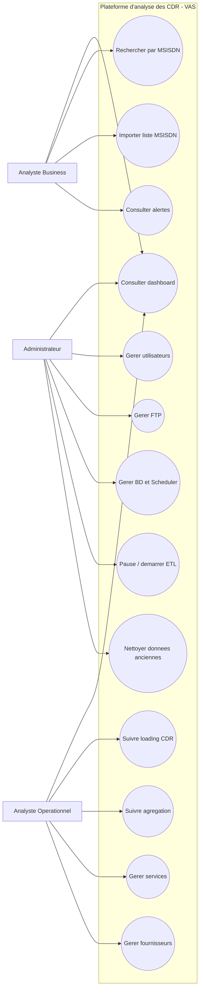
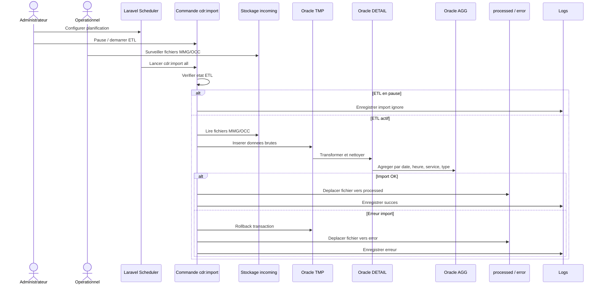
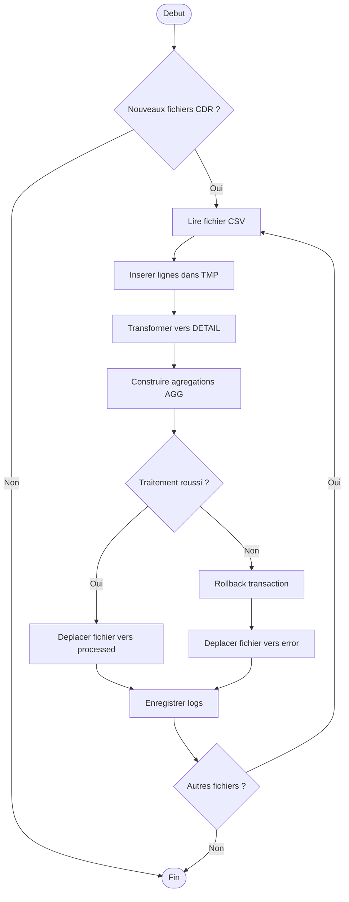
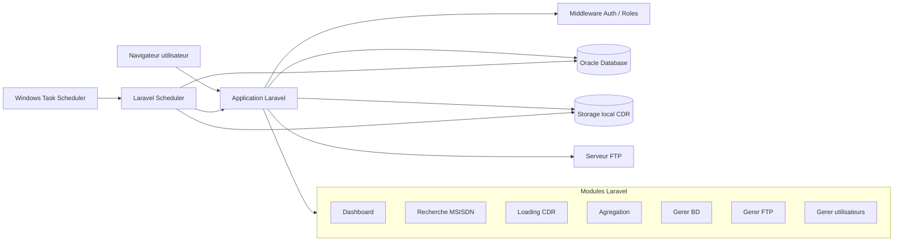
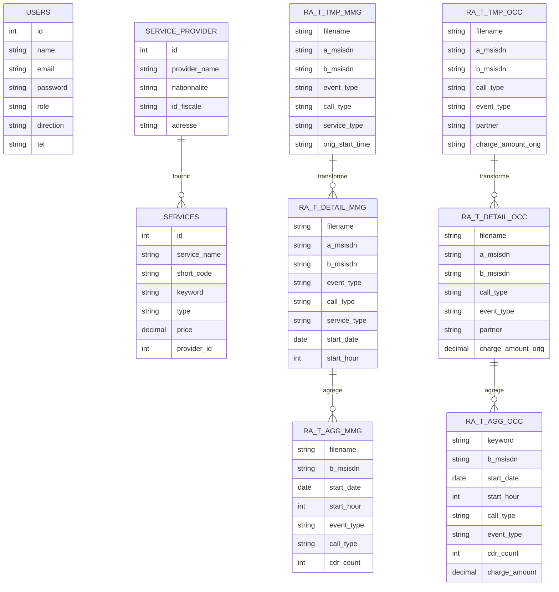
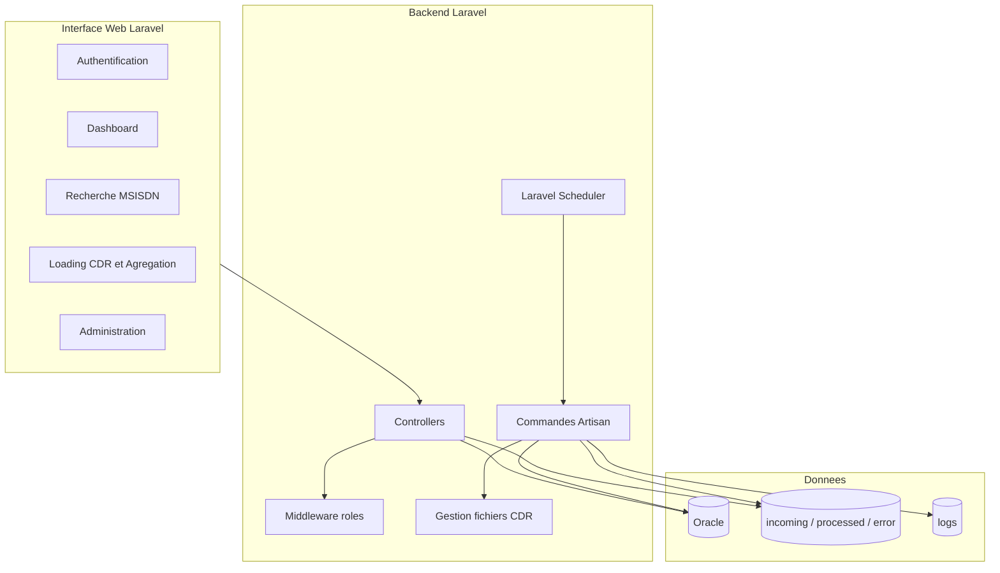
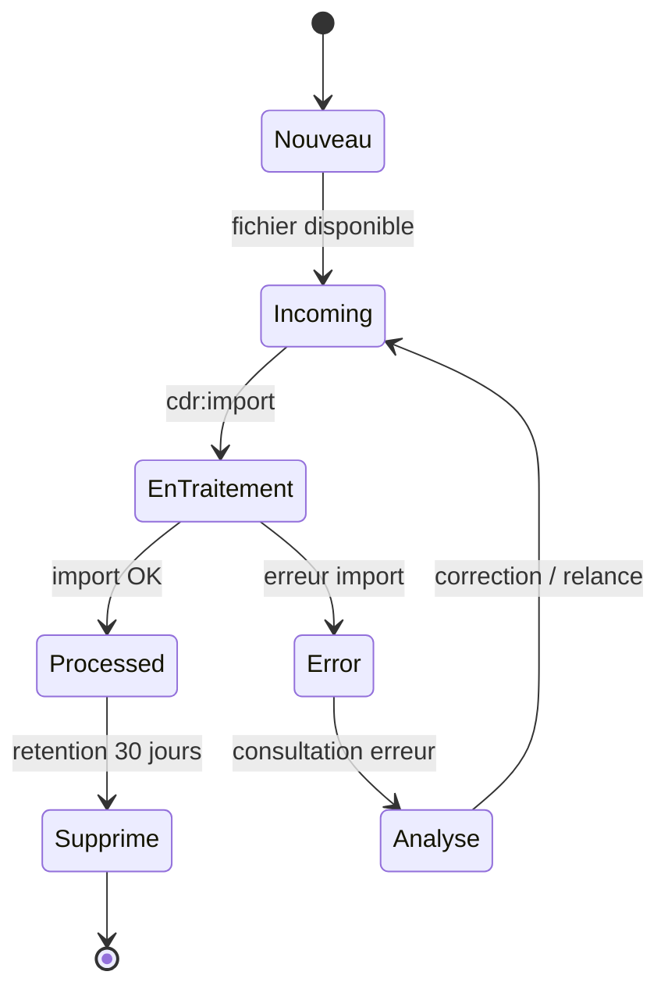

# Diagrammes du projet VAS CDR

Ce document regroupe les principaux diagrammes proposes pour le rapport du projet.
Les diagrammes sont ecrits avec Mermaid et peuvent etre colles dans Mermaid Live Editor,
VS Code, GitHub ou un outil compatible Mermaid.

## 1. Diagramme de cas d'utilisation

## 2. Diagramme de sequence - ETL CDR

## 3. Diagramme d'activite - Traitement ETL

## 4. Diagramme d'architecture

## 5. Diagramme de base de donnees simplifie

## 6. Diagramme de composants

## 7. Diagramme d'etat des fichiers CDR

